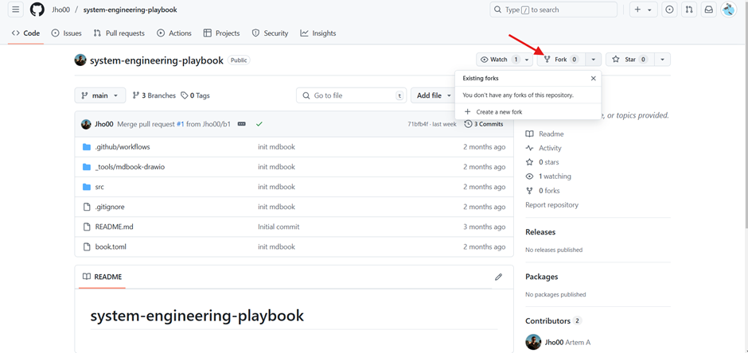
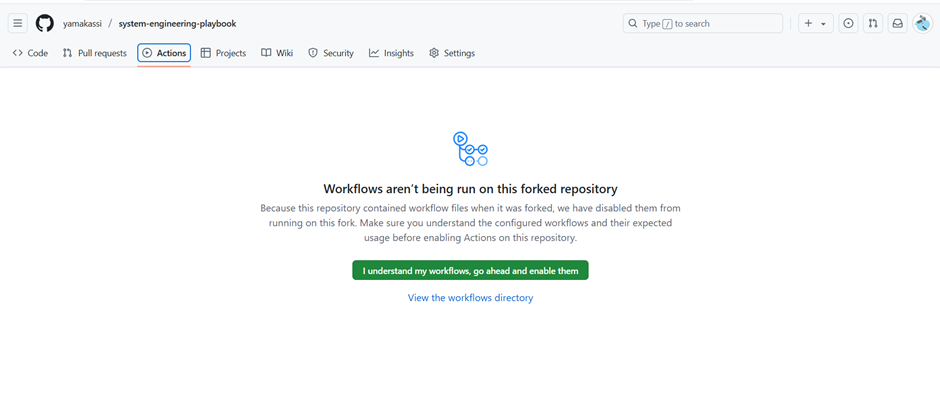
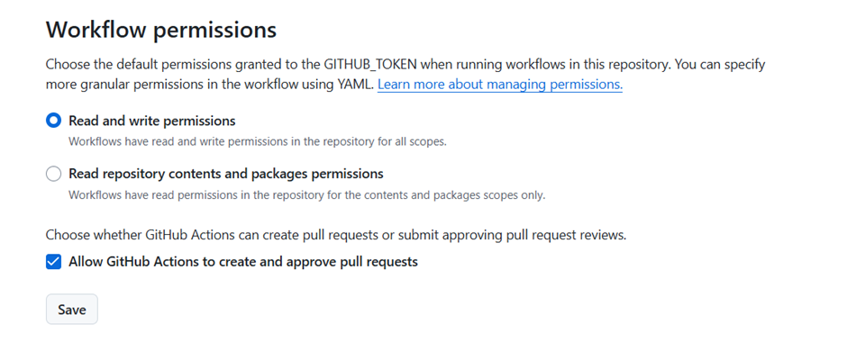
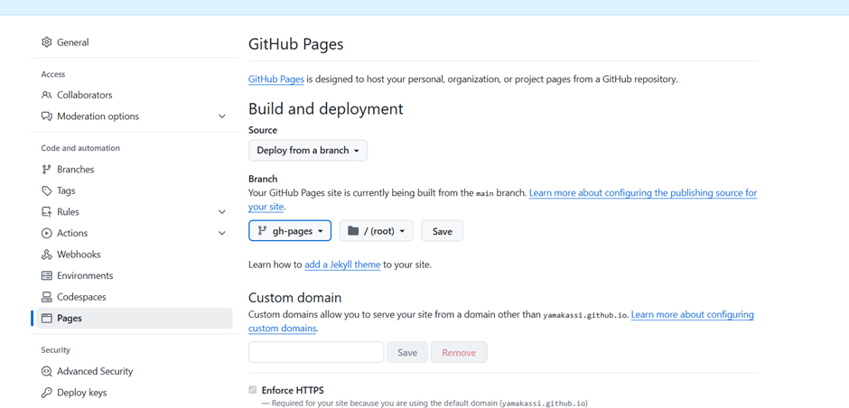
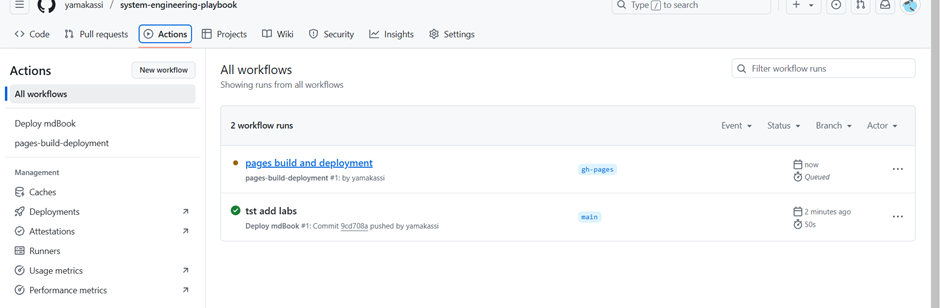
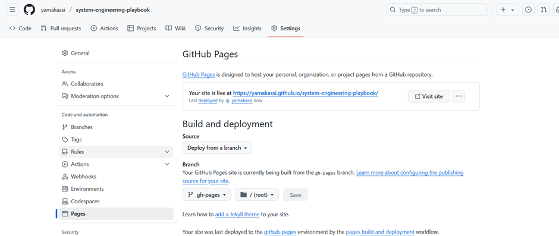

# Инструкция для работы с репозиторием и mdbook

*Документация mdbook можно найти по ссылке - https://rust-lang.github.io/mdBook/index.html*

### 1. Создайте fork репозитория

### 2. После создания форка перейдите во вкладку `Actions`. 
Github сообщает, что увидел настройки workflows. Теперь необходимо нажать на кнопку `I understand my workflows, go ahead and enable them`.

### 3. Предоставление доступа workflows к репозиторию 
Для этого перейдите на вкладку `Settings` -> `Actions` -> `General`. Установите "Read and write permissions" в категории Workflow permissions.

### 4. Теперь можно внести какие-либо изменения в свой проект
Для этого можно стянуть репозиторий через команду `git clone`, внести изменения, сделать коммит и запушить в удалённый репозиторий. После этого пайплайн в github репозитории должен автоматически запуститься.

### 5. Далее откройте `Settings` и вкладку `Pages`
На шаге этапе важно дождаться, когда отработает пайплайн на предыдущем шаге. При первом запуске он создаёт ветку `gh-pages`, которая пригодится на данном этапе.
- Установите source на 'deploy from a branch'
- Выберите ветку `gh-pages` и нажмите Save

### 6. После этого запустится сборка mdbook

### 7. Вернитесь в `Settings` -> `Pages` и там будет ссылка на размещенный mdbook
Она будет такого вида: https://[github_user_name].github.io/system-engineering-playbook/

