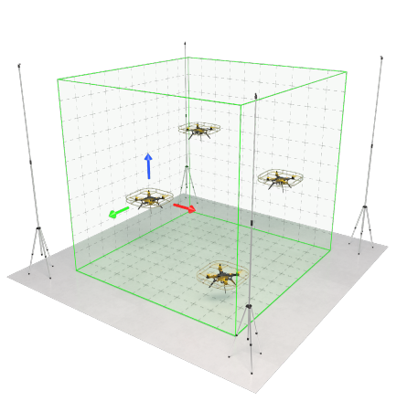
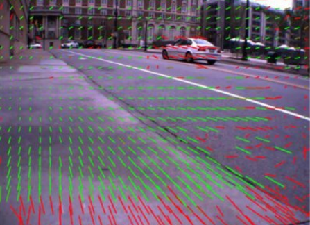

[Ссылка на статью](https://vc.ru/dev/2649708-v-poiskah-avtonomnogo-poleta)

# Текст статьи

# В поисках автономного полета

В данной статье рассматриваются основные способы автономных полетов на дроне, проблемы, которые могут возникнуть при реализации автономного полета.

# Введение

На данный момент беспилотным аппаратом является летающее устройство, на борту которого отсутствует пилот. Но при этом пилотов как таковых они до сих пор не лишены. Можно ли считать оператора управляющего дроном с наземной станции пилотом вопрос спорный, но факт остается в том, что дроны в нынешнем состоянии требуют больше автономности.

Для того чтобы сделать дрон автономным нужно, чтобы он знал свое местоположение. Существует три основных способа объяснить дрону где он находится:

GPS/ГЛОНАСС датчики;

Ультразвуковое позиционирование;

Позиционирование с использованием оптического потока.

Подробнее о каждом методе дальше в статье.

# Использование GPS/ГЛОНАСС

GPS является самым популярным способом для автономных полетов на улице. Данный способ позиционирования используют как компании-производители, так и простые энтузиасты.

Главными плюсами такого способа являются в первую очередь распространенность и простота использования. GPS, как пример, установлен в каждом телефоне и беспилотном автомобиле. В идеальном мире его было бы достаточно, но как только мы начинаем использовать GPS возникают следующие проблемы:

Малая точность позиционирования: данная система еще не на столько развита, чтобы обеспечить точность позиционирования меньше 1 м, что может стать критичной проблемой для многих задач.

Невозможность полета в помещениях: как только мы хотим использовать любые датчики GPS не на открытом пространстве сигнал от спутников как по щелчку пропадает.

Глушилки и подмена сигнала: особенно актуальная сейчас проблема. Покрытие сигнала все еще не охватывает весь земной шар, так еще в целях безопасности многие места оборудуют глушилками, что даже навигатор в телефоне улетает в другой город.

Несмотря на вышеперечисленные проблемы, позиционирование только с использованием GPS/ГЛОНАСС сигнала будет уместно, как пример, в "агродронах". Для полива или опрыскивания от вредителей не требуется высокая точность позиционирования, а для полета внутри помещений они вряд ли будут использоваться.

# Использование ультразвуковых (УЗ) датчиков

В некоторых случаях, когда не работают датчики GPS, для реализации автономного полета используют специальные ультразвуковые датчики. Обычно они используются для полетов в помещении. Полностью собранная такая система выглядит примерно следующим образом:

"Локус" - УЗ система навигации для дронов Геоскан Пионер

Данная система повышает точность позиционирования, что важно для дронов небольшого размера. Также она решает проблему полета в помещении.

Но данная система также не является универсальной ввиду следующих недостатков:

Дальность работы такой системы сильно ограниченна, из-за чего она не подходит для полетов на открытой местности;

Глушилки и помехи также являются серьезной проблемой для такой системы;

Личный опыт использования такого подхода показывает, что УЗ-система требует тонкой и сложной настройки для качественной работы. Неправильная калибровка одного датчика, смещение на 1 см влево могут сильно ухудшить точность позиционирования.

Такая система может быть полезной, например, для реализации работы беспилотников на складах и промышленных помещениях, но совершенно не подходит для полетов на улице.

# Использование оптического потока

Самым универсальным способом навигации на данный момент является навигация при помощи оптического потока. Она позволяет реализовать автономный полет как в помещении, так и на открытой местности. Именно по этой причине для своего проекта я выбрал данный способ навигации.

В данных системах чаще всего используется алгоритм Optical flow, который определяет горизонтальное смещение дрона. В связке с лазерным дальномером, который дает информацию о высоте, дрон получает все необходимые координаты.

Пример работы алгоритма Optical flow

Чтобы реализовать автономный полет по оптическому потоку потребуется достаточно много усилий.

В первую очередь необходимо поставить на свой полетный контроллер прошивку, которая поддерживает датчики оптического потока. Мой выбор пал на Ardupilot (открытая прошивка с большим сообществом). Базовая версия не даст нам реализовать автономный полет без GPS. Чтобы включить нужные нам функции прошивки нужно на данном сайте выбрать свой полетный контроллер и собрать конфигурацию с функциями Optical flow.

Сейчас уже есть готовые решения, которые в себе содержат как дальномер, так и оптический датчик. Например, Holybro H-Flow или MTF-01.

Также мной была протестирована система состоящая из программируемой камеры OpenMV и дальномера TFMini Plus. В результате удалось поднять дрон в автономном режиме на высоту до 10 м. Для многих задач этого уже будет достаточно, но в будущем хотелось бы улучшить данную систему.

# Заключение

Для каждой задачи может существовать свое более подходящее решение. В рамках данной статьи были рассмотрены основные способы навигации БПЛА. Если вы как и я ищете более универсальное решение стоит обратить внимание на оптические датчики.

В рамках своего проекта я разрабатываю собственную систему оптической навигации, о которой может быть расскажу в будущих статьях.

Теги: дроны, дроны квадрокоптер, optical flow, gps-навигация, оптический поток
Хабы: Алгоритмы, Анализ и проектирование систем, Искусственный интеллект, Мультикоптеры