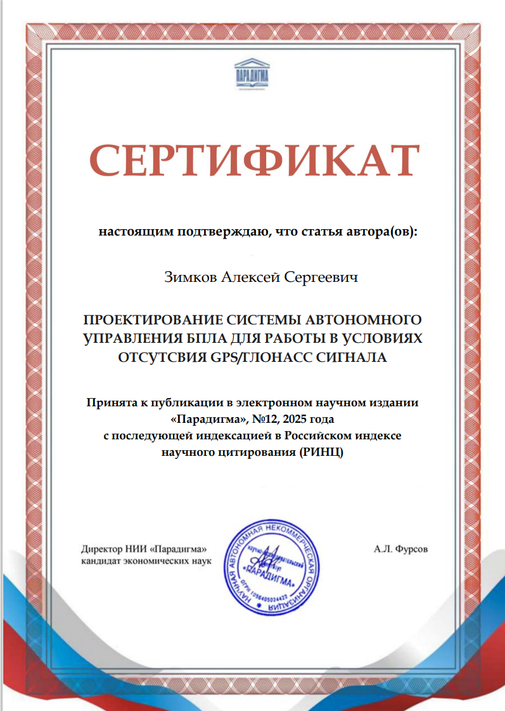
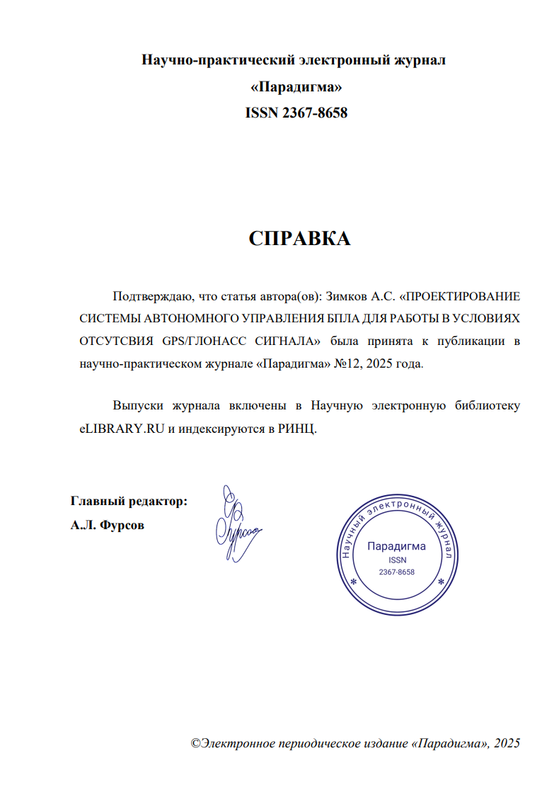

[Ссылка на сайт журнала](https://paradigma.science/)
[Ссылка на карточку журнала на elibrary](https://elibrary.ru/title_about_new.asp?id=58036)

# Справка и сертификат о публикации

# Текст статьи

УДК 004.896
Зимков А.С.
студент
2 курс, магистратура «ИФСТ» 
СГТУ имени Гагарина Ю.А 
Россия, г. Саратов
ПРОЕКТИРОВАНИЕ СИСТЕМЫ АВТОНОМНОГО УПРАВЛЕНИЯ БПЛА ДЛЯ РАБОТЫ В УСЛОВИЯХ ОТСУТСВИЯ GPS/ГЛОНАСС СИГНАЛА

Аннотация: Статья посвящена проектированию системы автономного управления беспилотным летательным аппаратом (БПЛА) для работы в условиях отсутствия спутниковой навигации GPS/ГЛОНАСС. Предложена архитектура системы, основанная на использовании оптического потока (Optical Flow), нейросетевых алгоритмов компьютерного зрения и инерциальных датчиков. В качестве аппаратной платформы используется микрокомпьютер Raspberry Pi 5 в комплексе с камерой IMX477 и лазерным дальномером benewake TFMini. Программное обеспечение реализует функции локальной навигации, детекции объектов с использованием нейросетей YOLO, управления полетным контроллером по протоколу MAVLink и выполнения автономных миссий.
Ключевые слова: беспилотный летательный аппарат, автономная навигация, optical flow, компьютерное зрение, нейросети YOLO, Raspberry Pi, навигация без GPS, автономные миссии.
Zimkov A.S.
Student
2nd year, Master's Degree Program «IFST»
Yuri Gagarin Saratov State Technical University 
Russia, Saratov
DESIGN OF AN AUTONOMOUS UAV CONTROL SYSTEM FOR OPERATION IN THE ABSENCE OF GPS/GLONASS SIGNALS

Annotation: This article focuses on the design of an autonomous control system for unmanned aerial vehicles (UAVs) to operate in the absence of GPS/GLONASS satellite navigation. The proposed system architecture is based on the use of optical flow (Optical Flow), neural network algorithms for computer vision and inertial sensors. As a hardware platform, a Raspberry Pi 5 microcomputer is used in conjunction with an IMX477 camera and a benewake TFMini laser rangefinder. The software implements functions of local navigation, object detection using YOLO neural networks, flight controller control via the MAVLink protocol and autonomous missions.
Key words: unmanned aerial vehicle, autonomous navigation, optical flow, computer vision, YOLO neural networks, Raspberry Pi.
 
# 1. Введение
Разработка систем автономного управления беспилотными летательными аппаратами (БПЛА) для работы в условиях отсутствия спутниковой навигации представляет собой актуальную научную и практическую задачу. Согласно исследованиям, традиционные инерциальные навигационные системы обладают накапливающейся ошибкой, что делает их недостаточно точными для длительных автономных полетов. 
В условиях городской застройки, лесных массивов, подземных сооружений или при целенаправленном подавлении спутниковых сигналов возникает необходимость в альтернативных методах позиционирования.
Современные исследования показывают, что использование оптического потока (Optical Flow) позволяет достичь точности позиционирования до 4 метров при полетах на фиксированной высоте. 
Применение нейросетевых технологий для обработки видеопотока в реальном времени открывает новые возможности для создания интеллектуальных автономных систем.
Целью данной работы является проектирование комплексной системы автономного управления БПЛА, способной функционировать в условиях полного отсутствия GPS/ГЛОНАСС сигнала, с обеспечением возможности выполнения различных практических сценариев.

# 2. Анализ существующих решений
Анализ современных научных публикаций показывает, что проблема автономной навигации БПЛА без спутниковых сигналов активно исследуется в научном сообществе. В работах предлагаются подходы к навигации на основе определения элементов движения (линейных и угловых), что позволяет строить траектории движения в GPS-отрицательных условиях.
Однако многие существующие решения либо требуют дорогостоящего оборудования, либо имеют ограниченную функциональность.

# 3. Архитектура предлагаемой системы

## 3.1. Аппаратная часть
Предлагаемая система автономного управления представляет собой программно-аппаратный комплекс, интегрируемый с существующим полетным контроллером БПЛА. Основой системы является навигационный модуль, состоящий из следующих компонентов:
Микрокомпьютер Raspberry Pi 5 – обеспечивает вычислительную мощность для обработки видео в реальном времени и выполнения алгоритмов машинного обучения. Выбор данной платформы обусловлен оптимальным соотношением производительности, энергопотребления и стоимости.
Камера IMX477 с разрешением 12.3 Мп и поддержкой 4K-видео – обеспечивает высококачественный видеопоток для анализа оптического потока и детекции объектов. Камера ориентирована вниз для получения изображений поверхности во время полета.
Лазерный дальномер benewake TFMini – обеспечивает точное измерение высоты полета с точностью ±5 см в диапазоне до 12 метров. Данные о высоте критически важны для корректного расчета оптического потока.
Модуль связи по UART – обеспечивает взаимодействие с полетным контроллером по протоколу MAVLink, что позволяет интегрировать систему с различными типами БПЛА, поддерживающими данный протокол.

## 3.2. Программная архитектура
Программное обеспечение системы реализовано на языке Python с использованием следующих ключевых компонентов:

### 3.2.1. Модуль визуальной одометрии на основе Optical Flow
Для определения относительного перемещения БПЛА используется алгоритм Lucas-Kanade Optical Flow. Математическая модель расчета векторов смещения может быть представлена следующим образом:
I(x + Δx,y + Δy,t + Δt) = I(x,y,t)
где I – интенсивность пикселя, (x, y) – координаты пикселя, t – время.
С использованием разложения Тейлора и предположения о постоянстве интенсивности получаем основное уравнение оптического потока:
Ix·vx + Iy·vy + It = 0
где Ix, Iy, It – частные производные интенсивности по x, y и t соответственно, vx, vy – компоненты вектора скорости.
Экспериментальные исследования показывают, что интеграция данных от оптического потока с показаниями лазерного дальномера позволяет достичь точности позиционирования до 0.3 метра на высоте 2 метра.

### 3.2.2. Модуль детекции объектов на основе нейросетей
Для распознавания объектов в видеопотоке используется предобученная нейросеть YOLOv5. Архитектура YOLO (You Only Look Once) обеспечивает детекцию объектов в реальном времени с высокой точностью. Нейросеть дообучена на датасетах, содержащих изображения объектов, характерных для целевых сценариев применения системы.
Применение методов оптического потока для выделения динамических признаков движущихся объектов значительно повышает эффективность детекции в условиях изменяющейся освещенности и частичного перекрытия объектов.

### 3.2.3. Модуль управления и связи
Система реализует следующие функции управления:
Создание локального Wi-Fi сервера для взаимодействия с наземной станцией;
Трансляция видеопотока в реальном времени с использованием протокола WebRTC;
Обработка команд управления от оператора и автоматическое выполнение миссий;
Отправка команд полетному контроллеру по протоколу MAVLink;
Хранение и выполнение заранее запрограммированных миссий.
Протокол MAVLink выбран как стандарт де-факто для взаимодействия с полетными контроллерами БПЛА, что обеспечивает совместимость с различными аппаратными платформами.

# 4. Реализуемые сценарии применения

## 4.1. Дрон-фонарь
Данный сценарий предполагает удержание БПЛА в фиксированной точке над QR-кодом при различных внешних условиях. Система работает следующим образом:
Камера обнаруживает QR-код на поверхности
Рассчитываются координаты центра QR-кода в кадре
Система управления корректирует положение БПЛА для центрирования QR-кода
Лазерный дальномер поддерживает постоянную высоту полета
При изменении внешних условий (ветер, воздушные потоки) система автоматически компенсирует отклонения

## 4.2. Дрон-сопроводитель
В данном режиме БПЛА способен автоматически сопровождать движущийся объект (автомобиль, человек) после подтверждения оператора:
Оператор выбирает цель сопровождения на экране наземной станции
Нейросеть YOLO отслеживает выбранную цель в последующих кадрах
Алгоритм optical flow определяет относительное движение цели
Система управления рассчитывает оптимальную траекторию следования
БПЛА поддерживает безопасную дистанцию до цели (регулируется оператором)
Данный сценарий особенно актуален для применения в конвоях, мониторинге транспортных потоков и поисково-спасательных операциях.

## 4.3. Дрон-разведчик
Автономный режим, в котором БПЛА выполняет заранее запрограммированный маршрут полета и выполняет поиск заданных объектов:
Загружается маршрут полета (последовательность путевых точек)
При полете по маршруту система непрерывно анализирует видеопоток
Нейросеть детектирует интересующие объекты (например, автомобили, люди, специфическое оборудование)
При обнаружении объекта сохраняются его координаты (относительно начальной точки), изображение с выделением объекта и временная метка
После завершения миссии данные передаются оператору для анализа

# 5. Заключение
В результате проведенной работы разработана система автономного управления БПЛА для работы в условиях отсутствия GPS/ГЛОНАСС сигнала. Основные научные и практические результаты:
Предложена архитектура системы, интегрирующая методы оптического потока, нейросетевой детекции объектов и лазерного измерения высоты.
Разработан программный комплекс, реализующий функции визуальной одометрии, детекции объектов, управления полетом и взаимодействия с оператором.
Перспективными направлениями дальнейших исследований являются:
Интеграция дополнительных датчиков (ультразвуковые, лидары) для повышения надежности системы
Использование более совершенных архитектур нейросетей (YOLOv8, EfficientDet) для повышения точности детекции
Разработка адаптивных алгоритмов управления, учитывающих изменение внешних условий в реальном времени
Оптимизация энергопотребления для увеличения времени автономной работы
Разработанная система может найти применение в поисково-спасательных операциях, мониторинге труднодоступных объектов, охране периметров и других задачах, где отсутствует спутниковый сигнал или существует риск его подавления.
 
# Список использованных источников

1.	Клименко, В. А. Система навигации БПЛА с использованием встроенной RGB камеры / В. А. Клименко, Н. В. Белов // Технологии информационного общества : Сборник трудов XV Международной отраслевой научно-технической конференции «Технологии информационного общества», Москва, 03–04 марта 2021 года. – Москва: ООО "Издательский дом Медиа паблишер", 2021. – С. 312-314. – EDN DWJNUM.
2.	Лебедев, А. О. Алгоритм управления полетом БПЛА вдоль железной дороги с помощью технического зрения / А. О. Лебедев, В. В. Васильев, А. Г. Паулиш // Компьютерная оптика. – 2025. – Т. 49, № 2. – С. 320-327. – DOI 10.18287/2412-6179-CO-1532. – EDN DPNPWT.
3.	Патент на полезную модель № 164139 U1 Российская Федерация, МПК B64C 13/00, B64C 19/02, G05D 1/00. Интеллектуальная система автоматического управления беспилотным летательным аппаратом : № 2015155101/11 : заявл. 22.12.2015 : опубл. 20.08.2016 / П. В. Скрибцов, М. А. Червоненкис, С. Е. Соловьев ; заявитель Общество с ограниченной ответственностью "ПАВЛИН Технологии". – EDN JQFGWV.
4.	Интеллектуальная система мониторинга и адаптации маршрута беспилотных летательных аппаратов на основе нейросетевого анализа объектов риска / Д. А. Сергеев, Д. Г. Родионов, П. А. Поляков [и др.] // Программные системы и вычислительные методы. – 2025. – № 1. – С. 55-70. – DOI 10.7256/2454-0714.2025.1.73255. – EDN UZVYID.
5.	Дементьев, В. Е. Разработка алгоритмов навигации автономных летательных аппаратов на основе комплексирования разнородных навигационных данных / В. Е. Дементьев, Д. С. Кондратьев // Четырнадцатая национальная конференция по искусственному интеллекту с международным участием. КИИ-2014 : Труды конференции, Казань, 24–27 сентября 2014 года. Том 3. – Казань: РИЦ «Школа», 2014. – С. 256-264. – EDN TOVOIX.
6.	Гибридная технология автономного позиционирования БПЛА / Д. П. Тетерин, Е. А. Титенко, С. Н. Фролов [и др.] // Перспективные системы и задачи управления : Сборник трудов XX Юбилейной Всероссийской научно-практической конференции и XVI молодежной школы-семинара, п. Домбай, 07–11 апреля 2025 года. – Таганрог: ДиректСайнс (ИП Шкуркин Д.В.), 2025. – С. 80-87. – EDN ECEPBR.
7.	Лоскутников, А. А. Системы автоматического управления БПЛА / А. А. Лоскутников, Н. С. Сенюшкин, В. В. Парамонов // Молодой ученый. – 2011. – № 9. – С. 56-58. – EDN OFZMXF.
8.	Чжан, Л. Перспективные исследования в области визуально-инерциальной навигации / Л. Чжан, В. В. Лукьянов // Автоматизация. Современные технологии. – 2025. – Т. 79, № 1. – С. 14-19. – DOI 10.36652/0869-4931-2025-79-1-14-19. – EDN VJHFMA.
9.	Dahlem, M. A. Rotation-Invariant Optical Flow by Gaze-Depended Retino-Cortical Mapping / M. A. Dahlem, F. Worgotter // Lecture Notes in Computer Science. – 2002. – Vol. 2525. – P. 137-145. – EDN BEPMDT.
10.	Павленко, Б. В. Структура метаданных сегментов карт навигации дрона / Б. В. Павленко // Программная инженерия: методы и технологии разработки информационно-вычислительных систем (ПИИВС-2024) : Сборник материалов и докладов V Международной научно-практической конференции, Донецк, 27–28 ноября 2024 года. – Донецк: Донецкий национальный технический университет, 2024. – С. 154-158. – EDN WLUTYO.
11.	Леоненко, Г. А. Экономика применения беспилотников в сельском хозяйстве / Г. А. Леоненко, А. Б. Коржук // Агропромышленному комплексу – новые идеи и решения : материалы XXIV Внутривузовской научно-практической конференции, Кемерово, 05 февраля 2025 года. – Кемерово: Кузбасский ГАУ, 2025. – С. 374-378. – EDN DPFLPX.
12.	Воронович, А. М. Применение БПЛА для идентификации объектов лесной инфраструктуры / А. М. Воронович // Перспективы развития научных изысканий: теория, методология, практика : Сборник научных трудов по материалам VI Международной научно-практической конференции, Анапа, 28 июня 2025 года. – Анапа: ООО "Научно-исследовательский центр экономических и социальных процессов" в Южном Федеральном округе, 2025. – С. 13-19. – EDN DLVTNB.

Информация о себе: 89170263154, zimkov.leha@gmail.com

1.	https://www.elibrary.ru/item.asp?id=46130508
2.	https://www.elibrary.ru/item.asp?id=82448831
3.	https://www.elibrary.ru/item.asp?id=37568287
4.	https://www.elibrary.ru/item.asp?id=80583439
5.	https://www.elibrary.ru/item.asp?id=23252260
6.	https://www.elibrary.ru/item.asp?id=82821486
7.	https://www.elibrary.ru/item.asp?id=16907226
8.	https://www.elibrary.ru/item.asp?id=79704869
9.	https://www.elibrary.ru/item.asp?id=1398113
10.	https://www.elibrary.ru/item.asp?id=80372287
11.	https://www.elibrary.ru/item.asp?id=82319122
12.	https://www.elibrary.ru/item.asp?id=82686341

